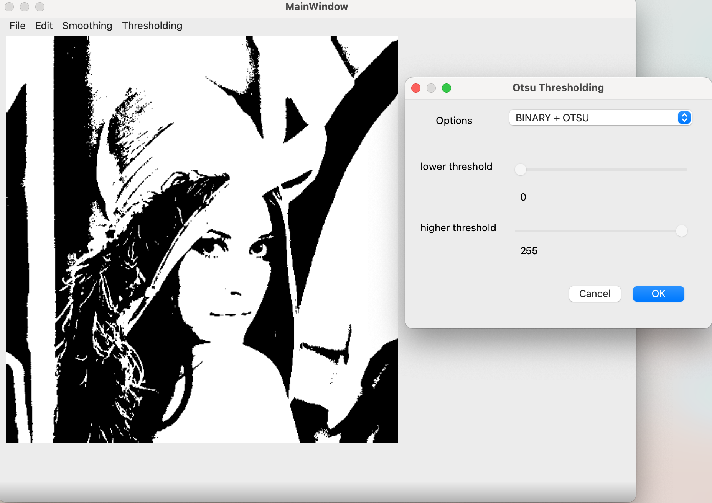

## Run Application
python Controller.py

## Forms-UI
1. MainUI.ui/MainUI.py
2. blurGaussian.ui/blurGaussian.py
3. otsu_Thresholding.ui/otsu_Thresholding.py

## UI Wrappers
1. MainApplication.py
2. blurGaussianWrapper.py
3. otsuThresholdingWrapper.py

## Controller
1. Controller.py

## Architecture

## App Preview

